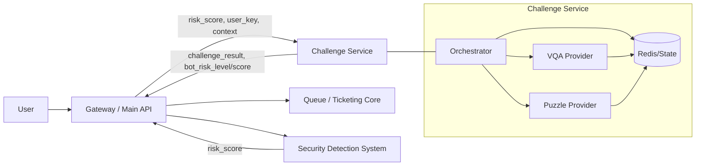
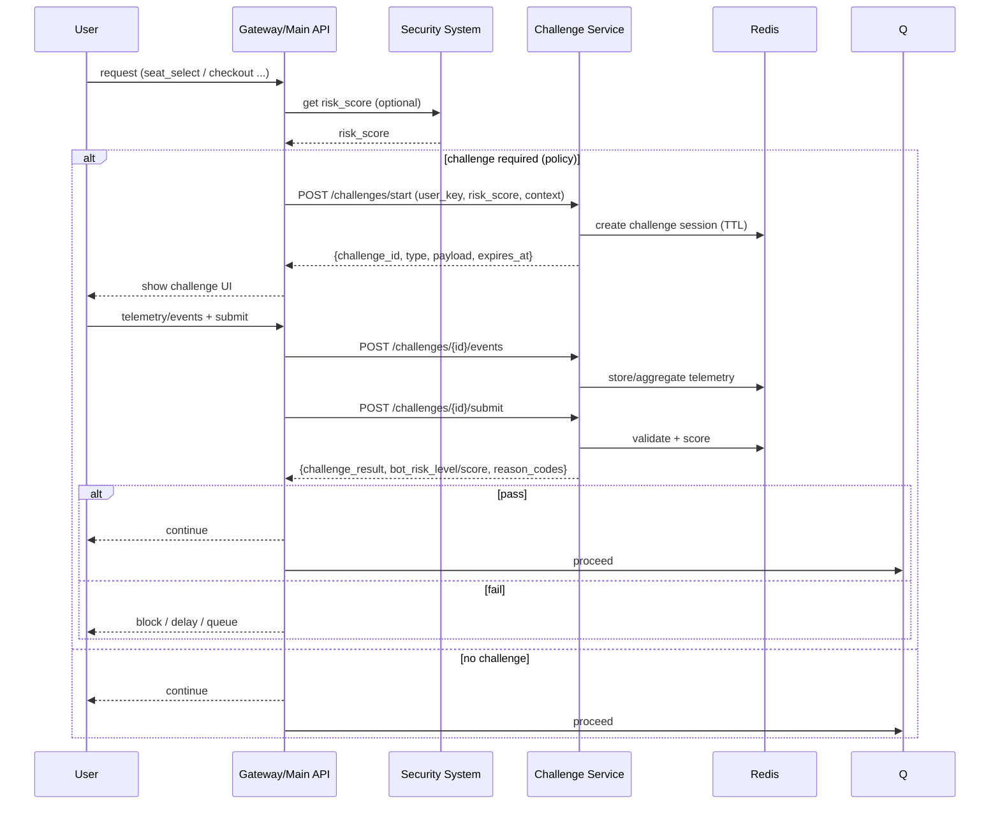

# System Architecture

이 문서는 VQA 기반 봇 탐지 시스템의 전체 구조를 설명합니다.

---

## System Overview

이 레포의 범위는 **VQA 퍼즐(챌린지) 안에서 발생하는 인터랙션**을 기반으로 자동화를 구분하는 것입니다.

- **VQA Module**: 챌린지 생성/검증(정답 판정)과 세션 관리
- **In-Challenge Detection Module**: 챌린지 내부 행동 신호(예: 클릭 패턴, 소요 시간, 재시도)를 이용해 bot risk를 계산


※ 전체 서비스 차원의 네트워크/세션/디바이스 기반 탐지(행동 분석)는 보안 파트의 별도 시스템에서 담당합니다.

---

## What we are building (Scope)

이 문서는 **아직 세부 정책이 확정되지 않은 상태**에서, 모듈화를 위해 필요한 최소 얼개를 정의합니다.

- 챌린지 서비스는 **의심 트래픽에만** 적용할 수도 있고, 상황에 따라 **전원/샘플링 적용**으로 전환할 수도 있습니다.
- 어떤 챌린지를 먼저 줄지(VQA vs 마우스/퍼즐) 또한 운영 정책으로 바뀔 수 있으므로, 서비스 설계는 정책 교체가 쉬워야 합니다.

---

## Architecture Diagrams

아래 다이어그램들은 “무엇을 그리면 되는지”에 대한 기본 세트입니다.
처음에는 ① 시스템 컨텍스트 → ② 요청 흐름(시퀀스) → ③ 챌린지 서비스 내부 구성 순으로 그리면 가장 빠르게 정리가 됩니다.

### 1) System context (서비스 경계)



### 2) Request flow (시퀀스)



### 3) Challenge service 내부 구성(컴포넌트)

```mermaid
flowchart TB
  API[FastAPI Controllers]
  API --> OR[Orchestrator policy]
  OR -->|type=vqa| VP[VQA Provider]
  OR -->|type=puzzle| PP[Puzzle Provider]

  API --> VAL[Answer Validator]

  %% Optional: interaction telemetry pipeline (challenge-type specific)
  API -. optional .-> TEL[Telemetry Ingest]
  TEL -. optional .-> AGG[Telemetry Aggregator]
  AGG -. optional .-> FEAT[Feature Builder]
  FEAT -. optional .-> DET[Bot Detector (rules/model)]

  VAL --> DET

  subgraph Storage
    RS[(Redis: session + aggregates)]
  end

  VP --> RS
  PP --> RS
  VAL --> RS
  TEL --> RS
  DET --> RS
```

---

## Policy (Orchestration)

정책은 아직 미정이므로, 초기에는 단순한 if-else로 시작합니다.
예: high risk → VQA, mid risk → 퍼즐, low risk → none(또는 샘플링)

정책은 코드 하드코딩 대신, 추후 다음 방식으로 교체할 수 있어야 합니다.

- config 기반(환경변수/JSON)
- feature flag
- A/B 실험

---

## Data minimization

- 입력 식별자는 `user_id` 대신 `user_key`(익명/해시)를 사용합니다.
- `device_info`는 필수 입력이 아니라 옵션으로 취급합니다.
- raw telemetry는 기본적으로 짧은 TTL로 보관하고, 외부에는 `challenge_result`와 `bot_risk`(등급/점수)만 제공합니다.

---

## VQA Module

이미지 기반 챌린지를 생성하고 응답을 평가하는 모듈입니다.

### pipeline.py

입력 요청을 처리하는 핵심 파이프라인입니다.

Flow:

```
input request
   ↓
preprocessing
   ↓
model inference
   ↓
postprocessing
   ↓
challenge result
```

Responsibilities:

- 입력 전처리
- 모델 추론 실행
- 결과 후처리

### evaluator.py

모델 성능과 오류 케이스를 분석합니다.

Responsibilities:

- 정확도 측정
- F1 score 계산
- 실패 케이스 수집

### (Optional) VQA interaction signals

VQA에서도 이벤트 기반(bot-like interaction) 신호를 사용할지는 아직 미정입니다.
만약 도입하더라도 퍼즐(드래그) 퀘스트와는 탐지 로직이 다를 가능성이 높습니다.
다만 텔레메트리 수집 스키마는 공통화하여 운영/저장/전송 파이프라인을 재사용할 수 있습니다.

---

## In-Challenge Detection Module

챌린지 내부 인터랙션(클릭/드래그/재시도 등)을 기반으로 bot risk를 계산하는 영역입니다. 단, 퍼즐(마우스) 퀘스트의 텔레메트리 처리와 탐지 로직은 별도 담당자가 구현/운영합니다.

### features.py

이 레포에서는 공통 텔레메트리 스키마/계약만 정의하고, 실제 피처 설계와 탐지 로직은 챌린지 타입별로 달라질 수 있습니다. (예: 퍼즐 드래그형 vs VQA 선택형)

Examples:

- 클릭/드래그 이벤트 시퀀스(순서/간격)
- 챌린지 해결 소요 시간
- 오답/재시도 횟수
- 정답 근접도(좌표/영역 선택형일 경우)
- 동일 세션 내 반복 시도 패턴

### detector.py

봇 여부를 판단하는 핵심 로직을 담당합니다.

Detection methods:

- Rule-based scoring
- Model-based scoring

이 두 결과를 조합하여 최종 bot risk score를 계산합니다.

---

## Interfaces and Data Contract

이 레포는 **챌린지 내부**에서 필요한 최소 인터페이스만 정의합니다.

### Challenge session

- `challenge_id`
- `session_id`
- `created_at / expires_at`
- `attempt_count`

### In-challenge telemetry

챌린지 화면에서 발생한 이벤트를 서버에 전달합니다.

- `event_type` (click/drag/submit/reset 등)
- `ts`
- `payload` (챌린지 타입별 데이터: 좌표/슬롯 이동/선택지/보드 상태 등)

### Outputs

- `challenge_result` (pass/fail/timeout)
- `bot_risk` (low/medium/high 또는 0~100 score)

※ 보안 파트 시스템과의 연동은 이 출력값을 외부에서 소비하는 형태로 이루어지며, 이 레포에서 네트워크/디바이스 지표 수집을 전제하지 않습니다.

---

## Design Principles

- 챌린지 내부 신호에만 의존 (외부 네트워크/디바이스 지표는 전제하지 않음)
- 인터페이스(입출력) 중심으로 모듈을 분리
- 모델/룰 교체가 쉬운 구조 유지

---


---

## Agentic LLM Opportunities

LangChain 같은 프레임워크를 ‘그냥 도입’할 이유는 현재 단계에선 크지 않습니다.
다만 **agentic LLM을 가치 있게 넣을 수 있는 자리**는 있습니다. 핵심은 “실시간 경로(critical path)”가 아니라 “오프라인/보조 워크플로우”에 붙이는 것입니다.

### 1) 정책/임계값 튜닝 보조 (offline)

- 최근 이벤트/로그를 요약해서 “어떤 실패 패턴이 늘었는지”를 정리
- reason_codes 분포 변화 감지 후, 정책 변경 제안(예: mid risk는 퍼즐 대신 VQA로)

### 2) 챌린지 품질 QA (offline)

- 신규 퍼즐/문항이 사람에게 과도하게 어렵지 않은지 체크리스트 기반 점검
- 퍼즐 변형(variant) 생성 후, ‘모호함/난이도’ 자동 검토

### 3) Red-team 시뮬레이션 (offline)

- 봇 관점의 공격 시나리오(반복/최적화 패턴)를 생성
- 탐지 로직이 취약한 케이스를 찾아내는 테스트 케이스 생성

### 4) 운영 플레이북 생성/업데이트 (docs)

- 장애/이상 탐지 시 대응 절차를 문서화하고 업데이트

※ 위 항목들은 모두 HTTP 서비스의 request-time 판단에 LLM을 넣지 않아도 구현 가능합니다.
(필요해지면, 단순한 Python worker + queue로도 충분하며 LangChain은 선택사항입니다.)

---

## Future Improvements

- 챌린지 유형 확장(좌표 선택형/순서형/정렬형 등)
- 텔레메트리 품질 개선 및 피처 표준화
- bot_risk 산정 로직(룰/모델) 실험 자동화