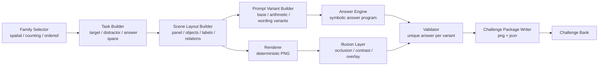
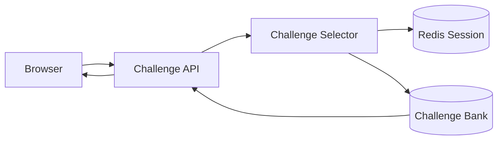

# VQA Generation Architecture

## 목적

이 문서는 illusion VQA challenge를 어떻게 생성할지에 대한 기반 아키텍처를 정의한다.
`10.VQA-Reasoning-Image-Direction.md`가 방향성 문서라면, 이 문서는 실제 구현 단위를 고정하는 기준 문서다.

핵심 원칙은 아래와 같다.

- scene generator가 아니라 `challenge package generator`를 만든다.
- 이미지 1장만 저장하지 않고 `prompt_variants`와 `answer_program`까지 같이 저장한다.
- illusion은 장식이 아니라 `answer-preserving visual transform`으로 다룬다.
- 초기 구현은 deterministic Python renderer로 시작하고, 이후 LangChain은 상위 orchestration에 붙인다.

---

## Offline Generation Flow



---

## Runtime Path



런타임에서는 생성이 아니라 선택과 검증이 핵심이다.
이미 만들어진 challenge package를 읽어와 세션별로 prompt variant를 할당한다.

---

## Core Components

### 1. Family Selector

역할:

- `spatial_reasoning`
- `conditional_counting`
- `ordered_interaction`

중 하나를 고른다.

추후 정책:

- risk score 기반 선택
- A/B 테스트
- challenge bank 노출 제어

### 2. Task Builder

역할:

- 정답 구조를 먼저 고정
- distractor가 왜 헷갈리는지 정의
- 허용 가능한 prompt variant 집합 정의

출력 예시:

```json
{
  "family": "spatial_reasoning",
  "reference_object_id": "ref_1",
  "target_object_ids": ["cand_c"],
  "distractor_object_ids": ["cand_a", "cand_b", "cand_d"]
}
```

### 3. Scene Layout Builder

역할:

- panel 배치
- object label 부여
- relative relation과 rotation 배치
- numeric/arithmetic prompt에 필요한 시각 단서 확보

이 단계에서 scene은 prompt를 만들 수 있을 정도로 충분히 구조화돼 있어야 한다.

### 4. Prompt Variant Builder

한 이미지에서 여러 문제를 파생하는 레이어다.

예시:

- base prompt: "기준과 같은 방향의 도형을 고르세요."
- count prompt: "기준과 같은 방향의 도형 수를 고르세요."
- arithmetic prompt: "기준과 같은 방향의 도형 수에서 빨간 삼각형 수를 뺀 값을 고르세요."

즉 `image 1장 -> prompt variants N개` 구조를 기본으로 한다.

### 5. Answer Engine

역할:

- prompt variant별 `answer_program` 실행
- object selection 또는 numeric answer 계산
- distractor choice 생성

예시:

```text
select(rotation == reference_rotation and shape == triangle)
count(rotation == reference_rotation)
count(rotation == reference_rotation) - count(color == red and shape == triangle)
```

### 6. Renderer

초기 MVP에서는 외부 이미지 리소스 없이도 재현 가능해야 하므로 Python 기반 deterministic renderer를 사용한다.

렌더링 범위:

- 2-panel layout
- shape rotation
- object labels
- subtle background pattern
- lightweight illusion transform

### 7. Illusion Layer

scene이 완성된 뒤 적용한다.
단, validator보다 뒤로 가면 안 된다.

허용되는 transform:

- partial occlusion
- low contrast
- pattern overlay
- texture blending

조건:

- 정답 구조는 유지돼야 한다.
- 사람의 solvability를 깨면 안 된다.

### 8. Validator

최소 검증 항목:

- 각 prompt variant별 unique answer
- choice set의 중복/모호성 없음
- scene과 prompt의 불일치 없음
- illusion 적용 후에도 핵심 단서 유지

### 9. Challenge Package Writer

출력물:

- `png`
- `json`

JSON에는 최소 아래가 들어가야 한다.

- family
- scene_objects
- prompt_variants
- answer_program
- expected_answer
- validation summary

---

## Package Contract

```json
{
  "challenge_id": "spatial_reasoning_0001",
  "family": "spatial_reasoning",
  "image_path": "generated/spatial_reasoning_0001.png",
  "prompt_variants": [
    {
      "prompt_id": "base_select",
      "prompt_text": "기준과 같은 방향의 도형을 고르세요.",
      "choices": ["A", "B", "C", "D"],
      "expected_answer": "C",
      "answer_program": "select(matches_reference_rotation_and_shape)"
    },
    {
      "prompt_id": "count_match",
      "prompt_text": "기준과 같은 방향의 도형 수를 고르세요.",
      "choices": ["1", "2", "3", "4"],
      "expected_answer": 2,
      "answer_program": "count(matches_reference_rotation)"
    }
  ]
}
```

---

## MVP Implementation Boundary

이번 단계에서는 아래까지만 구현하면 충분하다.

- `spatial_reasoning` family 1종
- deterministic image renderer
- prompt variants 2~3개
- answer engine
- package writer

아직 하지 않아도 되는 것:

- diffusion 기반 이미지 생성
- external API 기반 full-scene generation
- LangChain orchestration
- drag/swap 인터랙션

---

## LangChain 연결 시점

향후 LangChain은 아래 역할에 붙는 것이 맞다.

- family selection 정책
- prompt wording diversification
- challenge bank filtering
- offline batch generation orchestration

반대로 아래는 LangChain에 맡기지 않는 편이 안전하다.

- 정답 계산
- distractor uniqueness 보장
- scene geometry 결정

즉 LangChain은 `generator의 상위 orchestration`, 현재 Python 코드는 `정답 보장 하위 엔진`이다.
