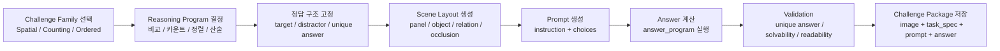
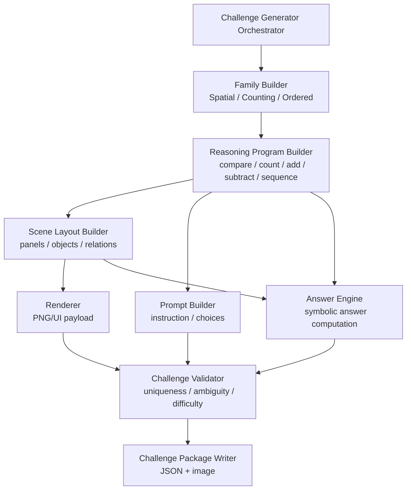

# VQA Reasoning Image Direction

## 로직 흐름

이 문서는 [`docs/01.SDD.md`](/Users/surf/Library/Mobile%20Documents/com~apple~CloudDocs/main/10.learning/300.Projs/303.ticketing_platform/vqa-bot-detection/docs/01.SDD.md)의 challenge 유형을 기본으로 둔다.

- `Spatial Reasoning`
- `Conditional Counting`
- `Ordered Interaction`

그리고 `Arithmetic Reasoning`은 별도 독립 family라기보다, 위 3개 family 위에 올라가는 `정답 계산 레이어`로 취급한다.

즉 생성 순서는 아래와 같다.



핵심은 `이미지를 먼저 만들고 질문을 붙이는 것`이 아니라, `정답 계산 구조를 먼저 확정하고 이미지를 그에 맞게 렌더링하는 것`이다.

---

## Component Architecture

구현 컴포넌트는 아래처럼 나누는 것이 가장 명확하다.



이 구조에서 `Arithmetic Reasoning`은 `PROGRAM`과 `ANSWER` 단계에 들어간다.
따라서 렌더러를 새로 만드는 문제가 아니라, family builder가 만든 시각 단서 위에 `산술 연산 가능한 answer program`을 얹는 문제로 다뤄야 한다.

---

## SDD Challenge 유형과의 매핑

[`docs/01.SDD.md`](/Users/surf/Library/Mobile%20Documents/com~apple~CloudDocs/main/10.learning/300.Projs/303.ticketing_platform/vqa-bot-detection/docs/01.SDD.md)의 유형을 기준으로 보면, 이 문서의 방향은 아래처럼 매핑된다.

| SDD 유형 | 이 문서에서의 생성 방식 | Arithmetic 결합 예시 |
| --- | --- | --- |
| Spatial Reasoning | reference panel, 방향/위치/관계 비교 | "기준과 같은 방향의 물체 수 + 빨간 삼각형 수" |
| Conditional Counting | 속성 조합 후 카운트 | "파란 원 개수 - 노란 사각형 개수" |
| Ordered Interaction | 순서/정렬 규칙을 scene spec으로 고정 | "왼쪽부터 1,3,5번째 태그 합" |

즉 `Arithmetic Reasoning`은 기존 3개 유형을 대체하는 것이 아니라, 그 위에 붙는 `answer derivation mode`다.

---

## 목적

현재 `/generated/scene_0001.png` 수준의 산출물은 "도형 몇 개가 배치된 이미지"에 가깝고, 사용자에게 어떤 reasoning task를 요구할지 이미지 자체만으로는 드러나지 않는다.

논문 `IllusionCAPTCHA`와 첨부된 reasoning CAPTCHA 예시를 기준으로 보면, 방향성의 핵심은 아래 2가지다.

1. 이미지는 단독 예술 결과물이 아니라 `질문 템플릿과 결합된 과업 인터페이스`여야 한다.
2. 문제 난이도는 단순 occlusion이 아니라 `사람은 직관적으로 풀고 모델은 헷갈리기 쉬운 의미적 혼란`에서 나와야 한다.

이 문서는 현재 MVP 생성기를 어떤 구조로 바꾸면 "방향이 맞다"라고 판단할 수 있는지 정의한다.

---

## 현재 상태 진단

현재 구현 [`src/vqa/illusion_vqa/generate_challenge.py`](/Users/surf/Library/Mobile%20Documents/com~apple~CloudDocs/main/10.learning/300.Projs/303.ticketing_platform/vqa-bot-detection/src/vqa/illusion_vqa/generate_challenge.py) 기준으로도, scene-only 사고방식에 머무르면 다음 한계를 피할 수 없다.

- 오브젝트 메타데이터가 `type`, `color`, `region`, `hidden` 정도라서 질문 생성 폭이 너무 좁다.
- `hidden=true`는 "가려졌다"는 렌더링 속성일 뿐, 과업 단서나 인간 친화적 reasoning을 만들지 못한다.
- 이미지 안에 `target`, `reference`, `distractor`, `interaction affordance`가 구분되지 않는다.
- 결과적으로 질문이 나와도 `"왼쪽 아래 숨겨진 파란 별은 무엇인가?"` 같은 synthetic QA에 머물고, CAPTCHA다운 행동 과업으로 이어지지 않는다.

즉, 현재 구조는 `scene generator`이지 `challenge generator`가 아니다.

---

## 논문/레퍼런스에서 가져와야 할 방향

첨부 예시들은 스타일은 서로 다르지만 공통 구조가 있다.

- Rotation CAPTCHA: `참조 자세`와 `조작 대상`이 분리돼 있다.
- Bingo CAPTCHA: `정렬 목표`와 `조작 가능한 타일 집합`이 분리돼 있다.
- 3D CAPTCHA: `속성 질의`와 `다수 후보 객체`가 분리돼 있다.

여기서 가져와야 할 것은 그림체가 아니라 아래 설계 원칙이다.

### 1. 장면(scene)보다 과업(task)이 먼저다

이미지를 먼저 랜덤 생성하고 질문을 얹는 방식이 아니라:

`task family 선택 -> 정답 구조 결정 -> distractor 설계 -> scene 렌더링`

순서로 가야 한다.

### 2. 정답 객체와 헷갈리는 오답 객체가 의도적으로 설계돼야 한다

논문 핵심은 사람에게는 쉬운 단서와 모델에게는 혼란스러운 단서를 동시에 넣는 것이다.

우리 MVP에서는 diffusion illusion까지 가지 않더라도 아래는 바로 가능하다.

- 같은 shape, 다른 orientation
- 같은 color family, 다른 size
- 같은 count pattern, 다른 row/column
- 같은 실루엣, 다른 내부 표식
- 부분 가림이 있지만 인간은 문맥상 복원 가능한 배치

### 3. 이미지와 질문은 함께 버전 관리돼야 한다

현재처럼 PNG와 scene JSON만 저장하면 부족하다.
최소한 아래 4종이 한 challenge instance로 묶여야 한다.

- `rendered_image`
- `task_spec`
- `question_payload`
- `answer_key`

---

## 새 MVP 방향: "Reasoning-first Challenge Generator"

현 단계에서 가장 안전한 방향은 diffusion 기반 환영(illusion) 생성이 아니라, `구조적 reasoning puzzle`을 먼저 고도화하는 것이다.

추천하는 1차 task family는 SDD 기준으로 아래 3개다.

### A. Spatial Reasoning

예: "왼쪽 카드와 같은 방향의 도형을 클릭하세요"
예: "기준과 같은 방향의 도형 수에서 빨간 삼각형 수를 뺀 값을 고르세요"

필요 요소:

- reference panel 1개
- candidate objects 4~6개
- orientation, color, shape 중 2개 이상 혼합
- distractor는 한 속성만 맞고 나머지는 틀리게 설계
- arithmetic가 붙을 경우 비교 결과를 count나 add/subtract로 연결

왜 좋은가:

- 현재 2D 렌더러로도 구현 가능
- 인간은 빠르게 비교 가능
- VLM은 orientation + instruction grounding에서 흔들릴 가능성이 있다

### B. Conditional Counting

예: "가장 작은 빨간 물체를 클릭하세요", "파란 원뿔 뒤에 있는 물체를 고르세요"
예: "파란 원 개수와 노란 사각형 개수를 더한 값을 선택하세요"

필요 요소:

- 객체별 속성: shape, color, size, depth_order, relation
- 질문이 최소 2개 속성을 조합해야 함
- 단일 속성만으로는 정답이 안 보이도록 distractor 설계
- arithmetic가 붙을 경우 `count(filtered_objects)`를 조합

왜 좋은가:

- 단순 counting보다 실서비스 QA 느낌이 강함
- question generation과 answer validation이 명확하다

### C. Ordered Interaction

예: "같은 표정 3개가 한 줄이 되도록 교환하세요"를 단순화해서,
MVP에서는 먼저 "세 개가 같은 열에 있는 아이콘을 고르세요"처럼 정적 QA로 시작한다.
예: "왼쪽부터 세 번째와 다섯 번째 물체의 숫자 태그 합을 고르세요"

필요 요소:

- 격자 기반 배치
- 패턴 단위 정의
- near-miss distractor
- arithmetic가 붙을 경우 순서 기반 선택 결과를 계산식에 사용

왜 좋은가:

- 향후 drag/swap 인터랙션으로 확장하기 쉽다
- challenge bank 품질 관리가 용이하다

---

## 코드 구조를 어떻게 바꿔야 하는가

핵심은 `랜덤 배치기`를 `과업 명세 기반 생성기`로 바꾸는 것이다.

### 변경 전

```text
random objects -> render png -> dump metadata
```

### 변경 후

```text
task family select
-> task spec build
-> scene layout build
-> render image
-> build question payload
-> compute answer key
-> run solvability validation
-> persist challenge package
```

---

## 권장 데이터 계약

현재 `SceneMetadata`만으로는 부족하다. 아래처럼 scene과 task를 분리해야 한다.

```python
from dataclasses import dataclass
from typing import Literal


TaskFamily = Literal[
    "spatial_reasoning",
    "conditional_counting",
    "ordered_interaction",
]


@dataclass
class SceneObject:
    id: str
    shape: str
    color: str
    size: str
    x: int
    y: int
    rotation_deg: int
    layer: int
    panel: str
    tags: list[str]


@dataclass
class PromptVariant:
    prompt_id: str
    prompt_text: str
    reasoning_ops: list[str]
    answer_program: str
    expected_answer: int | str
    choices: list[str]


@dataclass
class TaskSpec:
    family: TaskFamily
    target_object_ids: list[str]
    distractor_object_ids: list[str]
    reference_object_id: str | None
    required_skills: list[str]
    prompt_variants: list[PromptVariant]


@dataclass
class ChallengeInstance:
    challenge_id: str
    scene_objects: list[SceneObject]
    task: TaskSpec
```

이 구조의 장점은 `이미지 1장`에서 `문제 유형이 같은 prompt variant 여러 개`를 파생할 수 있다는 점이다.
예를 들어 같은 장면에서 `"파란 원의 개수"`, `"노란 사각형의 개수"`, `"두 값의 합"` 같은 문제를 각각 별도 제출할 수 있다.
단, 각 `prompt_variant`는 독립적으로 answer uniqueness를 만족해야 한다.

---

## 생성기 리팩터링 제안

### 1. Scene Generator를 family별 builder로 쪼갠다

현재 `SyntheticSceneGenerator.generate_scene()`는 모든 책임을 한 함수가 가진다.
이를 아래처럼 분리한다.

```python
class ChallengeGenerator:
    def __init__(self, seed: int | None = None) -> None:
        self.rng = random.Random(seed)

    def generate(self, challenge_id: str, out_dir: str) -> ChallengeInstance:
        family = self._pick_family()
        task = self._build_task_spec(family)
        scene_objects = self._build_scene_objects(task)
        prompt_variants = self._build_prompt_variants(task, scene_objects)
        self._validate(task, scene_objects, prompt_variants)
        self._render(challenge_id, out_dir, family, scene_objects)
        return ChallengeInstance(
            challenge_id=challenge_id,
            scene_objects=scene_objects,
            task=task,
        )
```

포인트는 `render`가 마지막 단계여야 하고, prompt/answer는 한 개가 아니라 `variant set`으로 관리될 수 있어야 한다는 것이다.

### 2. hidden flag를 폐기하고 occlusion/relation으로 바꾼다

`hidden: bool`는 너무 거칠다. 아래처럼 바꿔야 한다.

```python
@dataclass
class OcclusionSpec:
    mode: Literal["none", "partial", "overlap", "crop"]
    severity: float
    occluder_id: str | None


@dataclass
class SpatialRelation:
    subject_id: str
    relation: Literal["left_of", "right_of", "behind", "inside", "aligned_with"]
    object_id: str
```

이렇게 해야 "파란 원뿔 뒤의 작은 구" 같은 질의를 만들 수 있다.

### 3. panel 개념을 도입한다

논문 예시의 많은 문제는 `reference 영역`과 `candidate 영역`이 분리돼 있다.
현재 단일 캔버스만 쓰지 말고 최소 2-panel 레이아웃을 지원해야 한다.

```python
@dataclass
class PanelLayout:
    id: str
    role: Literal["reference", "candidate", "instruction"]
    x: int
    y: int
    width: int
    height: int
```

이 구조가 있으면 아래 같은 이미지가 가능해진다.

- 좌측: 기준 도형 1개
- 우측: 후보 4개
- 상단: instruction text

### 4. question template를 scene metadata에서 분리한다

현재 문서에서는 `scene metadata -> question template -> answer 계산` 정도만 적혀 있는데, 이러면 질문이 여전히 사후 생성물이 된다.

아래처럼 "template eligibility rule"을 두는 편이 낫다.

```python
QUESTION_TEMPLATES = {
    "spatial_reasoning": [
        "왼쪽 기준과 같은 방향의 도형을 고르세요.",
        "기준 카드와 동일한 회전 상태의 물체를 선택하세요.",
        "기준과 같은 방향의 도형 수에서 빨간 삼각형 수를 뺀 값을 고르세요.",
    ],
    "conditional_counting": [
        "가장 작은 빨간 물체를 고르세요.",
        "파란 삼각형 오른쪽에 있는 노란 물체를 고르세요.",
        "파란 원의 개수와 노란 사각형의 개수를 더한 값을 고르세요.",
    ],
    "ordered_interaction": [
        "왼쪽부터 세 번째와 다섯 번째 물체의 숫자 태그 합을 고르세요.",
    ],
}


def build_prompt(task: TaskSpec, objects: list[SceneObject], rng: random.Random) -> str:
    return rng.choice(QUESTION_TEMPLATES[task.family])
```

단, 실제로는 템플릿 선택 전에 해당 장면이 그 템플릿을 충족하는지 검증해야 한다.

### 5. challenge package 저장 포맷을 늘린다

현재는 PNG + JSON 2개뿐이다. 아래 형태로 바꾸는 것이 좋다.

```json
{
  "challenge_id": "challenge_0001",
  "family": "spatial_reasoning",
  "image_path": "generated/challenge_0001.png",
  "prompt_variants": [
    {
      "prompt_id": "p1",
      "prompt_text": "기준과 같은 방향의 도형 수를 고르세요.",
      "choices": ["1", "2", "3", "4"],
      "expected_answer": 3,
      "answer_program": "count(rotation==reference)"
    },
    {
      "prompt_id": "p2",
      "prompt_text": "기준과 같은 방향의 도형 수에서 빨간 삼각형 수를 뺀 값을 고르세요.",
      "choices": ["1", "2", "3", "4"],
      "expected_answer": 2,
      "answer_program": "count(rotation==reference) - count(color=red, shape=triangle)"
    }
  ],
  "scene_objects": [],
  "validation": {
    "prompt_variant_answers_unique": true,
    "min_distractor_count": 3,
    "human_readable": true
  }
}
```

이 파일이 있어야 이후 API payload와 challenge bank 저장도 바로 연결된다.

---

## MVP 품질 기준

아래 기준을 만족해야 "방향이 맞다"고 볼 수 있다.

### 반드시 만족

- 이미지를 본 사람이 질문 유형을 대략 예측할 수 있어야 한다.
- 하나의 이미지는 같은 family 안에서 여러 문제(`prompt variant`)를 파생할 수 있어야 한다.
- 단, 각 문제(`prompt variant`)마다 정답은 1개여야 한다.
- 오답은 "전혀 다른 것"이 아니라 정답과 헷갈릴 이유가 있어야 한다.
- 질문은 최소 2개 이상의 시각 단서를 사용해야 한다.
- challenge JSON만 읽어도 각 prompt variant의 answer derivation이 재현 가능해야 한다.

### 아직 안 해도 됨

- diffusion 기반 초현실 이미지
- 실제 illusionCAPTCHA 수준의 adversarial image synthesis
- 멀티스텝 drag interaction

초기 MVP는 `정적 이미지 + 명확한 reasoning prompt + 강한 distractor 설계`만 잡아도 충분하다.

---

## 우선순위 높은 코드 변경 순서

### Step 1. `SceneObject` 스키마 확장

추가 필드:

- `rotation_deg`
- `panel`
- `layer`
- `tags`
- `occlusion`

### Step 2. family별 generator 분리

신규 파일 예시:

```text
src/vqa/illusion_vqa/
  challenge_generator.py
  task_builders/
    spatial_reasoning.py
    conditional_counting.py
    ordered_interaction.py
  renderer.py
  answer_engine.py
  validator.py
```

### Step 3. validator 추가

validator는 최소 아래를 검사해야 한다.

- 각 prompt variant별 정답 유일성
- distractor 수 최소치
- prompt가 실제 scene spec과 일치하는지
- 사람이 읽을 instruction text가 포함됐는지

예시:

```python
def validate_prompt_variants(
    task: TaskSpec,
    objects: list[SceneObject],
    prompt_variants: list[PromptVariant],
) -> None:
    for variant in prompt_variants:
        answers = evaluate_answer_program(variant.answer_program, objects)
        if answers is None:
            raise ValueError(f"variant {variant.prompt_id} is not solvable")
        if isinstance(answers, list) and len(answers) != 1:
            raise ValueError(
                f"variant {variant.prompt_id} expected exactly one answer, got {len(answers)}"
            )
```

### Step 4. generated 샘플 구조 변경

샘플은 최소 3종 family를 각 5개 이상 자동 생성해서 사람이 직접 보고 판단할 수 있어야 한다.

예시 출력:

```text
generated/
  spatial_reasoning_0001.png
  spatial_reasoning_0001.json
  conditional_counting_0001.png
  conditional_counting_0001.json
  ordered_interaction_0001.png
  ordered_interaction_0001.json
```

이 단계가 되어야 현재처럼 "도대체 무슨 문제를 낼 건지 모르겠다"는 상태에서 벗어난다.

---

## 문서 관점의 결론

현재 이미지는 방향성이 완전히 틀렸다기보다, 너무 아래 레벨에서 시작해서 챌린지 구조가 보이지 않는 상태다.

따라서 다음 판단이 중요하다.

- `occlusion 있는 도형 랜덤 생성`을 계속 고도화하는 것은 우선순위가 아니다.
- 먼저 `사람이 이해 가능한 과업 구조`를 scene spec에 박아 넣어야 한다.
- 즉 다음 버전의 성공 기준은 "더 예쁜 이미지"가 아니라 "질문, 정답, 오답 설계가 선명한 이미지"다.

이 문서를 기준으로 다음 구현 단계에서는 `reference_match` family부터 먼저 코드화하는 것이 가장 안전하다.

---

## 바로 구현한다면 시작점

현재 코드베이스의 엔트리포인트는 [`src/vqa/illusion_vqa/generate_challenge.py`](/Users/surf/Library/Mobile%20Documents/com~apple~CloudDocs/main/10.learning/300.Projs/303.ticketing_platform/vqa-bot-detection/src/vqa/illusion_vqa/generate_challenge.py)처럼 challenge package generator를 직접 가리키는 편이 맞다.

추천 방식은 이 파일을 유지하되 내부를 아래처럼 축소하는 것이다.

```python
def main() -> None:
    generator = ChallengeGenerator(seed=42)
    challenge = generator.generate(challenge_id="spatial_reasoning_0001", out_dir="./generated")
    print("Generated:", challenge.challenge_id, challenge.task.family)
```

즉 엔트리포인트는 더 이상 scene-only generator가 아니라 challenge package generator의 thin entrypoint가 되어야 한다.
